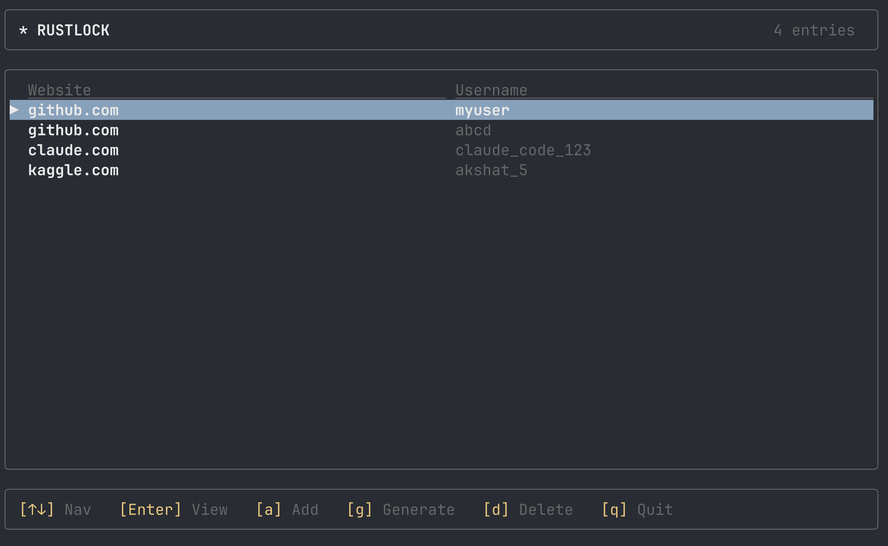
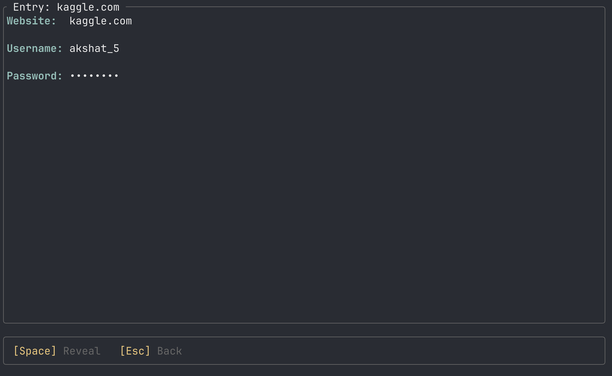
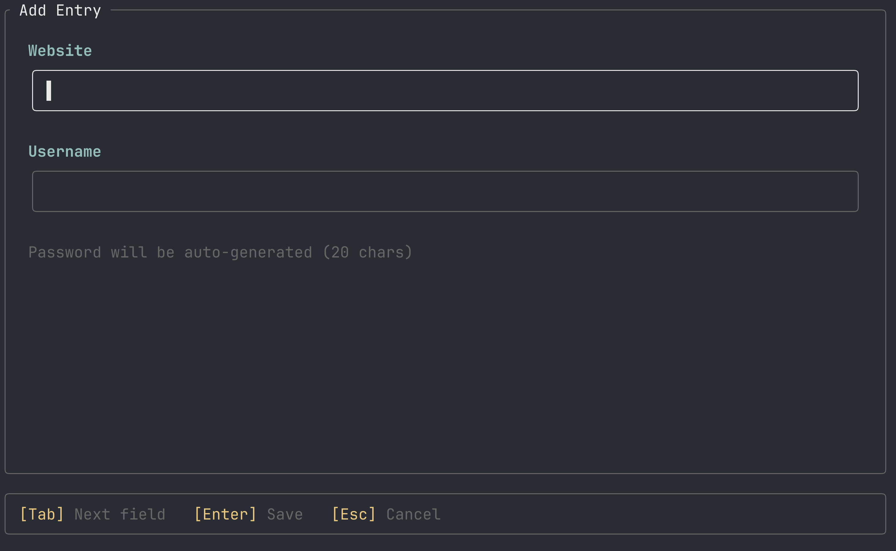
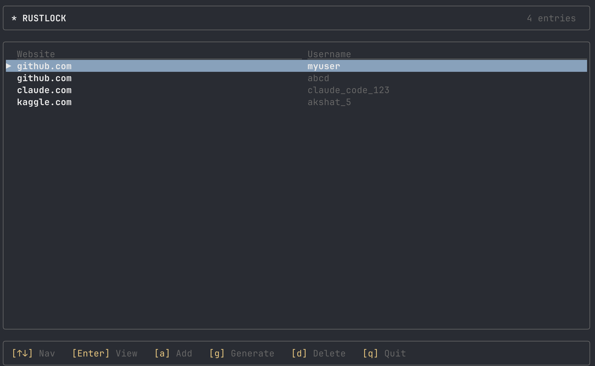

# rustlock

A local-first command-line password manager written in Rust.

<!-- Screenshot: TUI list view with a few entries -->


## Why

Rustlock stores everything locally in an encrypted vault that never leaves my machine. No cloud sync, no accounts, no subscriptions — just an encrypted file on disk.

## Features

- **TUI** — interactive terminal UI to browse, add, and delete credentials
- **Generate** cryptographically secure passwords (92-character alphabet, OS-level entropy)
- **Store** credentials with AES-256-GCM authenticated encryption
- **Retrieve** passwords by website name
- **List** all stored entries

## Demo

<!-- Screenshot: TUI detail view with password hidden -->


<!-- Screenshot: TUI add-entry form -->


## Security

| Component | Choice | Why |
|-----------|--------|-----|
| Encryption | AES-256-GCM | Authenticated encryption (confidentiality + integrity) |
| Key Derivation | Argon2id | Memory-hard (64MB), resistant to GPU brute-force |
| Random Generation | OS entropy | Cryptographically secure via `rand` crate |

### Vault File Format

```
[salt: 16 bytes][nonce: 12 bytes][ciphertext + auth_tag]
```

The salt is stored with the encrypted data so the same master password derives the same key. Each encryption uses a unique random nonce.

## Install

Requires [Rust](https://rustup.rs/).

```bash
git clone https://github.com/akshat-kalra/rustlock.git
cd rustlock
cargo install --path .
```

## Usage

### TUI (recommended)

```bash
rustlock tui
```

<!-- Screenshot: full TUI with help bar visible -->


| Key | Action |
|-----|--------|
| `↑↓` | Navigate entries |
| `Enter` | View entry details |
| `a` | Add new entry |
| `g` | Generate a password |
| `d` | Delete entry |
| `Space` | Reveal / hide password (in detail view) |
| `q` / `Esc` | Go back / quit |

### CLI

```bash
# Add a new entry (auto-generates a 20-char password)
rustlock add github.com myusername

# List all stored entries
rustlock list

# Retrieve a specific entry
rustlock get github.com

# Generate a standalone password
rustlock generate 24
```

## License

MIT
